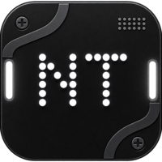

  
  

 

> **An Xposed module designed to customize and enhance the Nothing OS experience.**

By leveraging the modern Xposed framework, this module injects deep system-level tweaks allowing you to tailor your Nothing device exactly to your liking.

## ✨ Features

NothingTweaks comes packed with a variety of modifications to elevate your Nothing OS experience:

* **Gemini AI Chip**: Redirect the clipboard's AI integration to Gemini instead of ChatGPT.
* **Navigation Bar**: Hide the navigation pill while keeping gestures and Circle to Search active.
* **180° Screen Rotation**: Allows screen to be rotated 180°.
* **Scramble PIN**: Nothing to justify this.
* **Hide Space Under Keyboard**: Nothing to justify this too.
* **Screen Recording Limit**: Force screen recordings to cap at 720p or 1080p/60fps.
* **Fingerprint Scanner**: Set a custom or random color for the fingerprint animation.
* **Bluetooth Icon**: Show the Nothing earphone icon for all connected Bluetooth devices.
* **Advanced Power Menu**: Show options to reboot to recovery or bootloader in the power menu.
* **Power-Off Verify**: Skip credential verification when powering off from the lock screen.
* **Glimpse Ads**: Remove sponsored Glimpse Ads from the lock screen.
* **Clock Customization**: Add seconds, day of the week, or custom text to the status bar clock.
* **Screenshot Watermark**: Optionally draw your device's serial number onto screenshots.

*... and much more.*

## 🚀 Installation

1. Ensure your device is rooted and **[LSPosed](https://github.com/LSPosed/LSPosed)** is installed.
2. Download the latest NothingTweaks APK from the **[Releases](https://github.com/RevealedSoulEven/NothingTweaks/releases/)** page and install it.
3. Open the **LSPosed Manager** app and enable the NothingTweaks module.
4. Reboot your device (or restart `SystemUI` and `Nothing Launcher`) to apply the changes.
5. Open the **NothingTweaks** app to configure your settings!

## 🤝 Credits & Acknowledgements

This project would not have been possible without the amazing work of the Android modding community. Special thanks to:

* **[rovo89](https://github.com/rovo89)** - For creating the original [Xposed Framework](https://github.com/rovo89/Xposed), which pioneered this level of Android customization.
* **[LSPosed Team](https://github.com/LSPosed/LSPosed)** - For maintaining and advancing the modern ART hooking framework that powers this module today.

 

---
*Disclaimer: This module modifies system-level components. Use it at your own risk.*
